# 1. 栈和队列

## 1.1 设计一个有getMin功能的栈

### 题目

​	实现一个特殊的栈，在实现栈的基本功能的基础上，再实现返回栈中最小元素的操作。

### 要求

​	1. pop、push、getMin操作的时间复杂度都是$$O(1)$$

​	2. 设计的栈类型可以使用现成的栈结构

### 难度

​	士 一颗星

### 解答

​	设计思路为使用两个stack，一个用来存储正常stack数据，一个用来存储每次的最小值。有两种具体实现方式：

第一种设计方案：

-  压入数据规则

  假如当前数据为value，先将其压入stackData。然后判断stackMin是否为空

  - 如果stackMin为空，则直接将value压入stackMin
  - 如果value小于等于getMin的值，则将value压入stackMin
  - 如果value大于getMin的值，则stackMin中不压入任何数据
  - 

- 弹出数据规则

  ​	先在stackData中弹出栈顶元素，记为value，然后比较getMin的元素与value哪个更小。

  ​	通过上文提到的压入规则可知，stackMin中存在的元素是从栈底到栈顶逐渐变小的，stackMin栈顶的元素既是stackMin栈的最小值，也是当前stackData栈的最小值。所以不会出现value比stackMin的栈顶元素更小的情况，value只可能大于或等于stackMin的栈顶元素。

  - 仅当value等于stackMin的栈顶元素时，stackMin弹出栈顶元素

- 获取最小值

  由上文的压入和弹出数据规则可知，stackMIn始终记录着stackData的最小值，所以，stackMin的栈顶元素始终是当前stackData中的最小值

> tips：
>
> ​	所有pop或peek操作需提前校验是否为空

- 代码位置：com.tangwan.zuochengyun.chapter01_StackAndQueue.T01_GetMinFromStack.MyStack1


第二种设计方案：

- 压入数据规则

  假如当前数据为value，先将其压入stackData。然后判断stackMin是否为空

  - 如果stackMin为空，则直接将value压入stackMin
  - 如果value小于getMin的值，则将value压入stackMin
  - 如果value大于等于getMin的值，则stackMin中压入getMin

  - 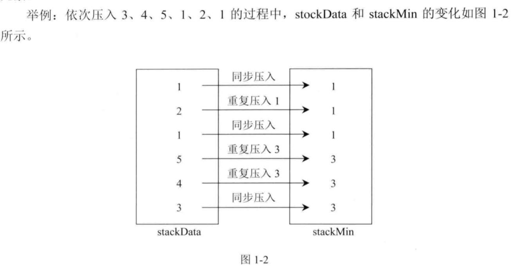

- 弹出数据规则

  stackData弹出，stackMin也弹出，因为stackData和stackMin是一对一的。

- 获取最小值：同上述方案

- 代码位置：com.tangwan.zuochengyun.chapter01_StackAndQueue.T01_GetMinFromStack.MyStack2

### 点评

方案一和方案二都是用stackMin栈保存着stackData每一步的最小值。

共同点：

- 所有操作的时间复杂度都是 $$O(1)$$、空间复杂度都为$$O(n)$$

区别：

- 方案一中stackMin压入时稍省时间，但是弹出操作稍费时间
- 方案二中stackMin压入时稍费时间，但是弹出操作稍省时间

### 完整代码位置

​	com.tangwan.zuochengyun.chapter01_StackAndQueue.T01_GetMinFromStack


## 1.2 由两个栈组成的队列

### 题目：

​	编写一个类，用两个栈实现队列，支持队列的基本操作（add、poll、peek）

### 难度：

​	尉 两颗星

### 解答：

​	栈的特点是FILO，而队列的特点是FIFO。使用两个栈正好能把顺序反过来实现类似队列的操作.

​	具体实现是：

-  一个栈作为压入，在压入数据的时候只往这个栈中压入，记为stackPush
- 另一个栈作为弹出栈，在弹出数据的时候只从这个栈弹出，记为stackPop


​	因为数据压入栈的时候，顺序是FILO的，那么只要把stackPush中的数据再压入stackPop中，顺序就变成FIFO了。

​	例如，将1~5依次压入stackPush，那么从stackPush的栈顶到栈底为5~1，此时依次再讲5~1倒入stackPop，那么从stackPop的栈顶到栈底就变成了1~5.再从stackPop弹出时，顺序就像队列一样，如下图所示。

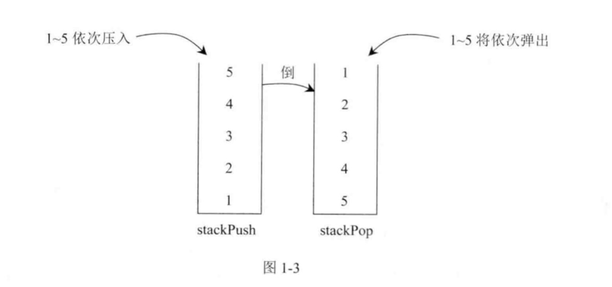


> tips：
>
> 上述过程需注意两点：
>
> 1. 如果stackPush要往stackPop中压入数据，那么必须一次性把stackPush中的数据全部压入
> 2. 如果stackPop不为空，stackPush绝对不能向stackPop中压入数据
>
> 违反了以上两点都会发生错误。


### 代码

​	com.tangwan.zuochengyun.chapter01_StackAndQueue.T02_QueueConsistingOfTwoStacks


## 1.3 如何仅用递归函数和栈操作逆序一个栈

### 题目

​	一个栈依次压入1、2、3、4、5，那么从栈顶到栈底分别是5、4、3、2、1。将这个栈转置后，从栈顶到栈底为1、2、3、4、5，也就是实现栈中元素的逆序，但是只能用递归函数来实现，不能使用其他数据结构

###难度

​	尉 两颗星

### 解答

​	本题考查的操作和递归函数的设计，我们需要设计出两个递归函数。


递归函数一：将栈stack的栈底元素返回并移除
具体过程如代码`getAndRemoveLastElement`方法

```java
    private static int getAndRemoveLastElement(Stack<Integer> stack) {
        Integer result = stack.pop();
        if (stack.isEmpty()) {
            return result;
        } else {
            int last = getAndRemoveLastElement(stack);
            stack.push(result);
            return last;
        }
    }
```

如果从栈stack的栈顶到栈底依次为3、2、1，这个函数的具体过程如图1-4所示。

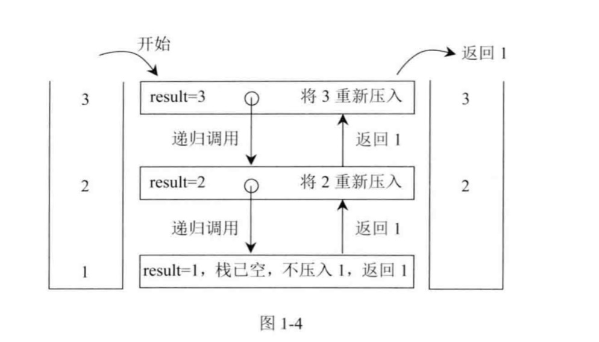


递归函数二：逆序一个栈

```
    public static void reverse(Stack<Integer> stack) {
        if (stack.isEmpty()) {
            return;
        }

        int i = getAndRemoveLastElement(stack);
        reverse(stack);
        stack.push(i);
    }
```

如果从stack的栈顶到栈底依次为3、2、1，reverse函数的具体过程如图所示：

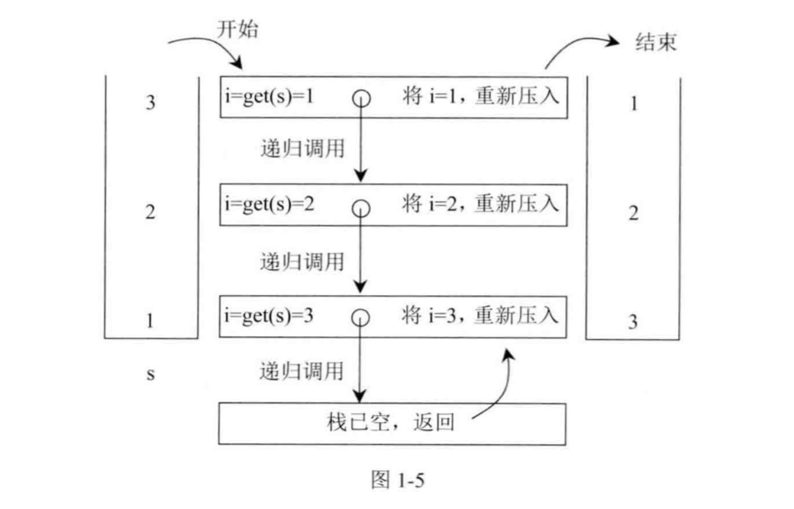

> tips：
> ​	getAndRemoveLastElement方法在上图中简单表示为get方法，表示移除并返回当前栈底元素


## 1.4 猫狗队列

### 题目

​	宠物、狗和猫的类如下：

```java
    public class Pet {
        private String type;

        public Pet(String type) {
            this.type = type;
        }

        public String getType() {
            return type;
        }

    }

    public class Dog extends Pet {
        public Dog() {
            super("dog");
        }
    }

    public class Cat extends Pet {

        public Cat() {
            super("cat");
        }
    }
```

实现一种狗猫队列的结构，要求如下：

- 用户可以调用add方法将cat类或dog类的实例放入队列中；
- 用户可以调用pollAll方法，将队列中所有的实例按照进队列的先后顺序依次弹出；
- 用户可以调用pollDog方法，将队列中dog类的实例按照进队列的先后顺序依次弹出；
- 用户可以调用pollCat方法，将队列中cat类的实例按照进队列的先后顺序依次弹出；
- 用户可以调用isEmpty方法，检查队列中是否还有dog或cat的实例；
- 用户可以调用isDogEmpty方法，检查队列中是否有dog类的实例；
- 用户可以调用isCatEmpty方法，检查队列中是否有cat类的实例。

###难度

士 一颗星

### 解答

​	本题考查实现特殊结构的能力以及针对特殊功能的算法设计能力。

​	本题为开放类型的面试题，希望读者能有自己的实现，在这里列出几种常见的设计错误：

- cat队列只放cat实例，dog队列只放dog实例，再用一个总队列放所有的实例。

  > 错误原因：cat、dog以及总队列的更新问题

- 用哈希表，key表示一个cat实例或dog实例，value表示这个实例进队列的次序。

  > 错误原因：不能支持一个实例多次进队列的功能需求，因为哈希表的key只能对应一个value值

- 将用户原有的cat或dog类改写，加一个计数项来表示一个实例进队列的时间。

  > 错误原因：不能擅自改变用户的类结构


​	本题实现将不同的实例盖上时间戳的方法，但是又不能改变用户本身的类，所以定义一个新的类，具体实现如下：

```java
    public static class PetEnterQueue {
        private Pet pet;
        private long count;

        public PetEnterQueue(Pet pet, long count) {
            this.pet = pet;
            this.count = count;
        }
    }
```


PetEnterQueue类在构造时，pet是用户原有的实例，count就是这个实例的时间戳。


​	我们实现的队列其实是PetEnterQueue类的实例。大体来说，首先有一个不断累加的数据项，用来表示实例进队列的时间；同时有两个队列，一个是只放dog类实例的队列dogQ，另一个是只放cat类实例的队列catQ。

- 加入实例时
  - 如果实例时dog，就盖上时间戳，生成对应的PetEnterQueue类的实例，然后放入dogQ
  - 如果实例时cat，就盖上时间戳，生成对应的PetEnterQueue类的实例，然后放入catQ
- 弹出dog实例
  - 从dogQ里弹出
- 弹出cat实例
  - 从catQ里弹出
- 弹出任意实例
  - 因为dogQ的队列头表示所有dog实例中最早进队列的，同时catQ一样，所以比较两个队列头的时间戳，谁早弹谁


### 代码位置

​	com.tangwan.zuochengyun.chapter01_StackAndQueue.T04_PetQueue


## 1.5 用一个栈实现另一个栈的排序

### 题目

​	一个栈中元素的类型为整型，现在想将该栈从顶到底按从大到小的顺序排序。

### 要求

​	只需申请一个栈。除此之外，可申请新的变量，但不能申请额外的数据结构。

###难度

士 一颗星

### 解答

​	将要排序的栈记为stack，申请的辅助栈记为help。在stack上执行pop操作，弹出的元素记为cur。

- 如果cur小于或等于help的栈顶元素，则将cur直接压入help；
- 如果cur大于help的栈顶元素，则将help的元素逐一弹出，逐一压入stack，直到cuur小于或等于help的栈顶元素，再将cur直接压入help；

​	一直执行以上操作，直到stack中的全部元素都压入到help。最后将help中的所有元素逐一压入stack，即完成排序

### 代码

com.tangwan.zuochengyun.chapter01_StackAndQueue.T05_SortStackByStack


## 1.6 用栈来求解汉诺塔问题

### 题目

​	汉诺塔问题比较经典，这里修改一下游戏规则：现在限制不能从最左侧的塔直接移动到最右侧，也不能从最右侧直接移动到最左侧，而是必须经过中间。求当塔有N层的时候，打印最优移动过程和最优移动总步数。

​	例如，当塔数为2层时，最上层的塔记为1，最下层的塔记为2，则打印：

> Move 1 from left to mid
> Move 1 from mid to right
> Move 2 from left to mid
> Move 1 from right to mid
> Move 1 from mid to left
> Move 2 from mid to right
> Move 1 from left to mid
> Move 1 from mid to right


### 要求

用以下两种方法解决：

- 方法一：递归的方法
- 方法二：非递归的方法，用栈来模拟汉诺塔的三个塔

###难度

校 三颗星

### 解答

#### 方法一：递归的方法。

首先，如果只剩最上层的塔需要移动，则有如下处理：

1. 如果希望从“左” 移到 “中”，打印“Move 1 from left to mid”。
2. 如果希望从“中” 移到 “左”，打印“Move 1 from mid to left”。
3. 如果希望从“右” 移到 “中”，打印“Move 1 from right to mid”。
4. 如果希望从“中” 移到 “右”，打印“Move 1 from mid to right”。
5. 如果希望从“左” 移到 “右”，打印“Move 1 from left to mid” 和 “Move 1 from mid to right”。
6. 如果希望从“右” 移到 “左”，打印“Move 1 from right to mid” 和 “Move 1 from mid to left”。

以上过程就是递归的终止条件，也就是只剩上层塔时的打印过程。


接下来，分析剩多层塔的情况。

如果剩下N层塔，从最上到最下依次为1~N，则有如下判断：

1. 如果剩下的N层塔都在 ’左‘ ，希望全部移到 “中”，则有三个步骤
   1. 将1~N-1层塔先全部从'左'移到'右'
   2. 将N层塔从'左'移到'中'
   3. 再将1~N-1层塔从'右'移到'中'
2. 和1同理的还有如下类型
   1. M->L
   2. M->R
   3. R->M
3. 如果剩下的N层塔都在’左‘，希望全部移到’右‘，则有5个步骤
   1. 将1~N-1层塔先全部从'左'移到'右'
   2. 将N层塔从'左'移到'中'
   3. 再将1~N-1层塔从'右'移到'左'
   4. 将N层塔从'中'移到'右'
   5. 再将1~N-1层塔从'左'移到'右'
4. R->L同3理

##### 代码位置：

com.tangwan.zuochengyun.chapter01_StackAndQueue.T06_Hanoi#hanoiWithRecursive2


#### 方法二：非递归的方法—用栈来模拟整个过程

​	修改后的汉诺塔问题不能让任何塔从“左” 直接移动到“右”，也不能从“右”直接移动到“左”，而是要经过中间。也就是说，实际动作只有4个：L->M，M->L，M->R，R->M。

​	现在把三个地点抽象成栈，依次记为LS、MS和RS。最初所有的塔都在LS上。那么如上4个动作可以看做是：某一个栈（from）把栈顶元素弹出，然后压入到另一个栈里（to），作为这一个栈（to）的栈顶。

​	例如，如果是7层塔，在最初时所有的他兜着LS上，LS从栈顶到栈底依次是1~7，如果现在时发生了“左”到“中”的动作，这个动作对应的操作是LS栈将栈顶元素1弹出，然后1压入MS栈中，成为MS的栈顶，其他的操作同理。

​	一个动作能发生的先决条件是不违反小压大的原则。

​	from栈弹出的元素num如果想压入to栈中，那么num值必须小于当前to栈的栈顶。

​	还有一个原则不是很明显，但也非常重要的，叫相邻不可逆原则，解释如下：

1. 我们把四个动作依次定义为：L->M，M->L，M->R，R->M。

2. 很明显，L->M和M->L过程互为逆过程，R->M和M->R过程互为逆过程.

3. 在修改后的汉诺塔游戏中，如果想走出最少步数，那么任何两个相邻的动作都不是互为逆过程的。

   > 举个例子：如果上一步的动作是L->M，那么这一步绝不可能是M->L。


有了小压大和相邻不可逆原则后，可以推导出两个是否有用的结论—非递归方法的核心结论：

1. 游戏的第一个动作一定是L->M
2. 在走出最少部署过程中的任何时刻，四个动作中只有一个动作不违反小压大和相邻不可逆原则，另外三个动作一定都会违反。


对于结论2，现在进行简单的证明：

因为游戏的第一个动作已经确定是L->M，则以后的每一步都会有前一步的动作。

假设前一步的动作是L->M：

1. 根据小压大的原则，L->M的动作不会重复发生。
2. 根据相邻不可逆原则，M->L的动作也不该发生。
3. 根据小压大的原则，M->R和R->M只会有一个达标。


假设前一步的动作是M->L：

1. 根据小压大的原则，M->L的动作不会重复发生。
2. 根据相邻不可逆原则，L->M的动作也不该发生。
3. 根据小压大的原则，M->R和R->M只会有一个达标。


假设前一步的动作是M->R：

1. 根据小压大的原则，M->R的动作不会重复发生。
2. 根据相邻不可逆原则，R->M的动作也不该发生。
3. 根据小压大的原则，M->L和L->M只会有一个达标。


假设前一步的动作是R->M：

1. 根据小压大的原则，R->M的动作不会重复发生。
2. 根据相邻不可逆原则，M->R的动作也不该发生。
3. 根据小压大的原则，M->L和L->M只会有一个达标。

综上所述，每一步只会有一个动作达标。那么只要每走一步都根据这两个原则考查所有的动作就可以，哪个动作达标就走哪个动作，反正每次都只有一个动作满足要求，按顺序走下来即可。


#### 代码位置

​	com.tangwan.zuochengyun.chapter01_StackAndQueue.T06_Hanoi


## 1.7 生成窗口最大值数组

### 题目

​	有一个整型数组arr和一个大小为w的窗口从数组的最左边滑到最右边，窗口每次向右边滑一个位置。

​	例如，数组为[4,3,5,4,3,3,6,7],窗口大小为3时：

> [4 3 5] 4 3 3 6 7  窗口中最大值为5
>
> 4 [3 5 4] 3 3 6 7  窗口中最大值为5
>
> 4 3 [5 4 3] 3 6 7  窗口中最大值为5
>
> 4 3 5 [4 3 3] 6 7  窗口中最大值为4
>
> 4 3 5 4 [3 3 6] 7  窗口中最大值为6
>
> 4 3 5 4 3 [3 6 7]  窗口中最大值为7


如果数组长度为m，窗口大小为w，则一共产生n-w+1个窗口的最大值。

请实现一个函数：

- 输入：整型数组arr，窗口大小为w
- 输出：一个长度为n-w+1的数组res，res[i]表示每一种窗口状态下的最大值。

以本题为例，结果应该返回{5,5,5,4,6,7}

###难度

尉 两颗星

### 解答

​	如果数组长度为N，窗口大小为w，如果做出时间复杂度$$O(N*w)$$ 的解法是不能让面试官满意的，本题要求面试者想出时间复杂度$$O(N)$$的实现。

​	本题的关键在于利用双端对了来实现窗口最大值的更新。首先生成双端对了qmax中存放数组arr中的下标。

​	假如遍历到arr[i],qmax的放入规则为：

1. 如果qmax为空，直接把下标i放入qmax队尾
2. 如果qmax不为空，取出当前qmax队尾存放的下标，假设为j
   1. 如果arr[j] > arr[i],直接把下标i放入qmax队尾
   2. 如果arr[j] <= arr[i],弹出qmax队尾元素，继续qmax的放入规则。


​	假设遍历到arr[i],qmax的弹出规则为：

​	如果qmax队头的下标等于i-w，说明当前qmax队头的下标已过期，弹出qamx队头下标

​	生成结果规则：当i>=w-1的时候，窗口开始w步滑动，每次滑动的最大值即为结果

​	

​	根据如上的规则，qmax便成了一个维护窗口为w的子数组的最大值更新的结构。下面举例说明题目给出的例子。

1. 开始时qmax为空
2. 遍历到arr[0]=4,将下标0放入qmax

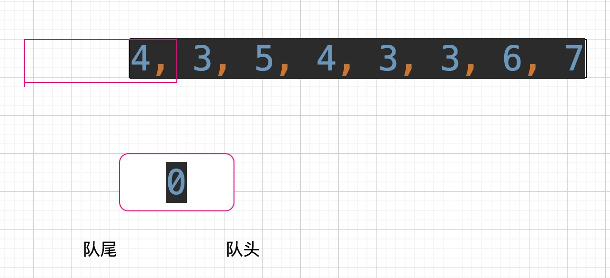

3. 遍历到arr[1]=3,当前qmax队尾下标为0，又有arr[0]>arr[1],所以将下标1放入队尾

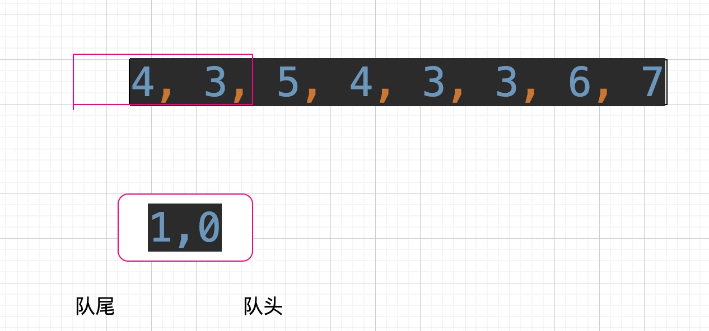

4. 遍历到arr[2]=5
   1. 当前qmax队尾下标为1，又有arr[1]<=arr[2],所以qmax尾部弹出
   2. 当前qmax队尾下标为0，又有arr[0]<=arr[2],所以qmax尾部弹出
   3. qmax为空，将下标2放入qmax
   4. 此时已经遍历到下标2的位置，窗口arr[0..2]出现，当前qmax下标为2，所以res[0]=5

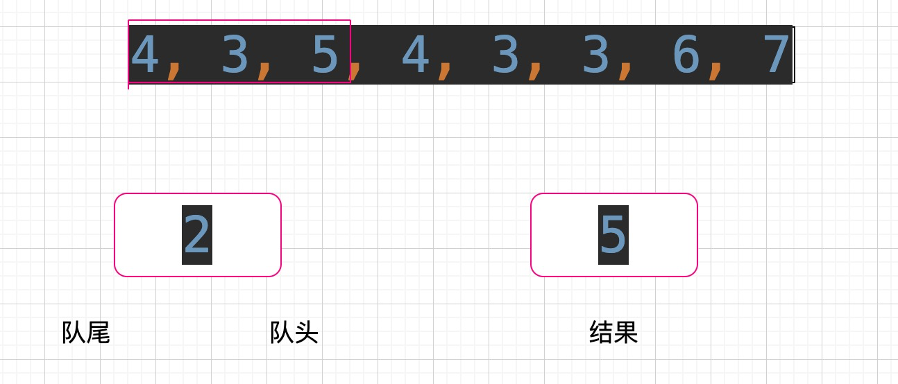

5. 遍历到arr[3]=4
   1. 当前qmax队尾下标为2，又有arr[2]>arr[3],所以将下标3放入队尾
   2. 窗口arr[1..3]出现，当前qmax下标为2，所以res[0]=5

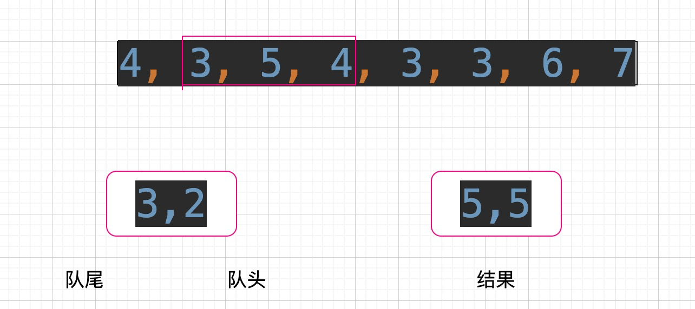

6. 遍历到arr[4]=3
   1. 当前qmax队尾下标为3，又有arr[3]>arr[4],所以将下标4放入队尾
   2. 窗口arr[2..4]出现，当前qmax下标为2，所以res[0]=5


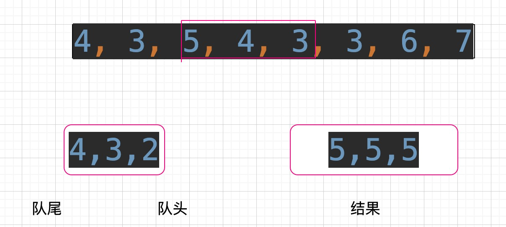

7. 遍历到arr[5]=4
   1. 当前qmax队尾下标为4，又有arr[4]<=arr[5],所以qmax弹出
   2. 当前qmax队尾下标为3，又有arr[3]>arr[5],所以将下标5放入队尾
   3. 当前队头的下标为2，已过期，所以从qmax队头弹出
   4. 窗口arr[3..5]出现，当前qmax下标为3，所以res[0]=4


8. 遍历到arr[6]=6
   1. 当前qmax队尾下标为5，又有arr[5]<=arr[6],所以弹出
   2. 当前qmax队尾下标为3，又有arr[3]<=arr[6],所以弹出
   3. qmax为空，下标6入队
   4. 窗口arr[4..6]出现，当前qmax下标为6，所以res[0]=6


9. 遍历到arr[7]=7
   1. 当前qmax队尾下标为6，又有arr[6]<=arr[7],所以弹出
   2. qmax为空，下标7入队
   3. 窗口arr[5..7]出现，当前qmax下标为7，所以res[0]=7

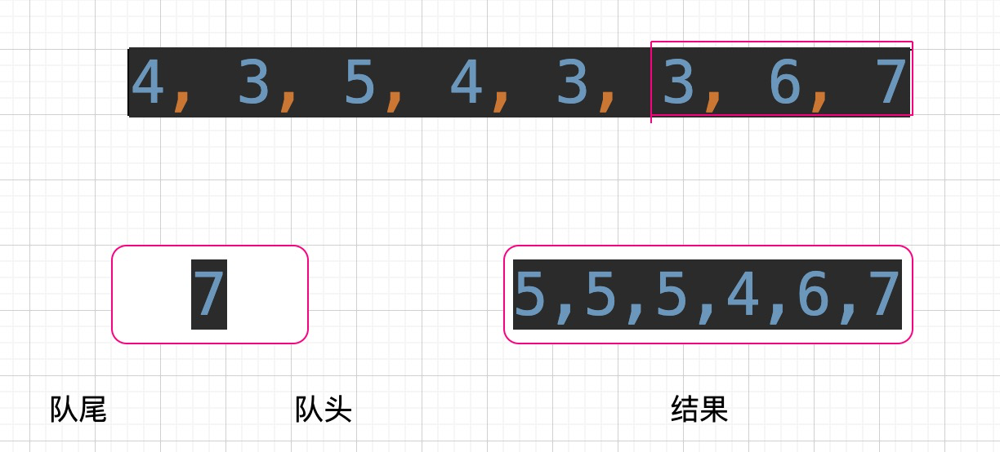


上述过程中，每个下标值最多进qmax一次，出max一次，所以遍历的过程中进出双端队列操作的时间复杂度为$$O(N)$$, 整体的时间复杂度也为$$O(N)$$。


#### 代码位置：

com.tangwan.zuochengyun.chapter01_StackAndQueue.T07_GetMaxWindow


## 1.8 构造数组的MaxTree

### 题目

定义二叉树节点如下：

```java
    public class Node {
        public int value;
        public Node left;
        public Node right;

        public Node(int value) {
            this.value = value;
        }
    }
```

一个数组的MaxTree定义如下：

- 数组必须没有重复元素
- MaxTree是一颗二叉树，数组的每一个值都对应一个二叉树节点
- 包括MaxTree树在内且在其中的每一棵子树上，值最大的节点都是树的头

给定一个没有重复元素的数组arr，写出生成这个数组的MaxTree的函数

### 要求

​	要求如果长度为N，则时间复杂度为$$O(N)$$，额外空间复杂度为$$O(N)$$。

###难度

校 三颗星


### 解答

​	下面举例说明如果在满足时间和空间复杂度的要求下生成MaxTree。

arr = {3 ,4 ,5 ,1, 2}

3的左边第一个比3大的数：无      3的右边第一个比3大的数：4

4的左边第一个比4大的数：无      4的右边第一个比4大的数：5

5的左边第一个比5大的数：无      5的右边第一个比5大的数：无

1的左边第一个比1大的数：5      1的右边第一个比1大的数：2

2的左边第一个比2大的数：5      2的右边第一个比2大的数：无


以下列原则来建立这棵树：

- 每一个数的父节点是它左边第一个比它大的数和它右边第一个比它大的数中，较小的那个。
- 如果一个数左边没有比它大的数，右边也没有。也就是说，这个数是整个数组的最大值，那么这个数是MaxTree的头结点。


那么 {3 ,4 ,5 ,1, 2}的MaxTree如下：

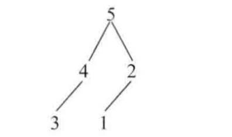


#### 代码位置

com.tangwan.zuochengyun.chapter01_StackAndQueue.T08_GetMaxTree


## 1.9 求最大子矩阵的大小

### 题目

给定一个整型矩阵map，其中的值只有0和1两种，求其中全是1的所有矩形区域中，最大的矩形区域为1的数量

例如：

1 1 1 0

其中，最大的矩形区域有3个1 ，所以返回3

再如:

1 0 1 1

1 1 1 1 

1 1 1 0

其中，最大矩形区域有6个1，所以返回6

###难度

校 三颗星

### 解答

​	如果矩阵的大小为$$O(N*M)$$, 本题也可以做到。

​	具体的解法为：

1. 矩阵的行数为N，以每一行做切割，统计以当前行作为底的情况下，每个位置上的1的数量。使用高度数组height来表示。

   > 例如：
   >
   > map = 1 0 1 1 
   >
   > ​	    1 1 1 1 
   >
   > ​             1 1 1 0
   >
   > 1. 以第一行切割后，height={1,0,1,1},height[j]表示目前的底上（第1行），j位置往上（包括j位置）有多少连续的1
   > 2. 以第二行切割后，height={2,1,2,2},注意到从第一行到第二行，height数组的更新规则：$$height[j] = map[i][j] == 0 ? 0 : height[j] + 1 $$.
   > 3. 以第三行切割后，height={3,2,3,0}

2. 对于每一次切割，都利用更新后的height数组来求出以每一行为底的情况下，最大的矩形是什么。那么这么多次切割中，最大的矩形就是我们要的。


重点介绍一下步骤2是如何快速实现的，这也是最重要的部分，如果height数组的长度为M，那么求解步骤2的过程可以做到时间复杂度为$$O(M)$$


对于height数组，可以理解为一个直方图，比如{3,2,3,0}，如图所示：

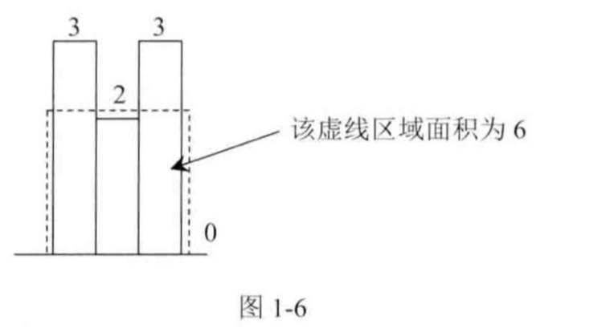

也就是说，步骤2的实质及随后在一个大的直方图中求最大矩形面积。如果我们能够求出以每一根柱子扩展出去的最大矩形，那么其中最大的矩形就是我们想要的。比如：

- 第一根高度为3的柱子无法向左扩展，它的右边是2，比3小，所以向右也无法扩展，则以第一根柱子为高度的矩形面积为 3 * 1 = 3；
- 第二根高度为2的柱子可以向左扩展1个距离，因为左边的3比2大；它的右边也是3，所以向右也可以扩展1个距离，，则以第二根柱子为高度的矩形面积为 2 * 3 = 6；
- 第三根高度为3的柱子无法向左扩展，向右也无法扩展，则以第三根柱子为高度的矩形面积为 3 * 1 = 3；
- 第四根高度为0的柱子无法向左扩展，向右也无法扩展，则以第四根柱子为高度的矩形面积为 3 * 1 = 3；

所以，当前直方图中最大矩形面积是6，也就是图中虚线框住的部分。


#### 代码位置

com.tangwan.zuochengyun.chapter01_StackAndQueue.T09_MaxRecSize


## 1.10 最大值减去最小值小于或等于num的子数组数量

### 题目

​	给定数组arr和整数num，共返回有多少个子数组满足如下情况：

- max(arr[i...j]) - min[arr[i...j]] <= num
- max(arr[i...j])表示数组arr[i…j]中的最大值
- mim(arr[i...j])表示数组arr[i…j]中的最小值

### 要求

​	如果数组长度为N，请事先时间复杂度为$$O(N)$$的解法

###难度

​	校 三颗星

### 解答

​	类似于”生成窗口最大值数组“问题。

​	生成两个双端队列qmax和qmin。

#### 代码位置

​	com.tangwan.zuochengyun.chapter01_StackAndQueue.T10_GetNum


# 2. 链表操作

## ​2.1 	

​	


